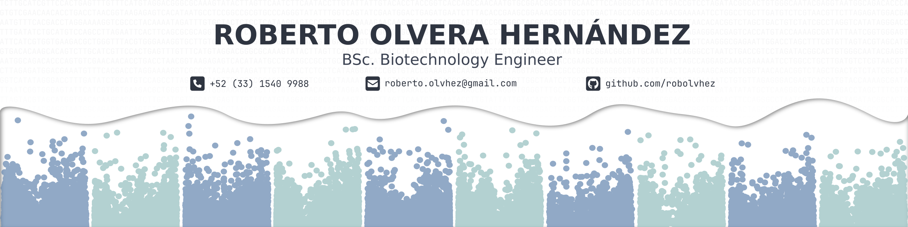

### Hey everybody! 👋 | It's me, Roberto Olvera-Hernandez

# ⚡ Rapid fire
<!-- - 🔭 I’m currently working on ... -->
- 🌱 I’m currently learning: BASH Pipelines | NextFlow (Azure/AWS) workflows | ShinyApps & DataBases
- 👯 I’m looking to collaborate on "omics" projects
<!-- - 🤔 I’m looking for help with ... -->
- 💬 Ask me about 
- 📫 How to reach me: roberto.olvhez@gmail.com | **LinkedIn** rob-olvhez
- 😄 Pronouns: he/him
<!-- - ⚡ Fun fact: ... -->

# 💻 Languages and Skills

