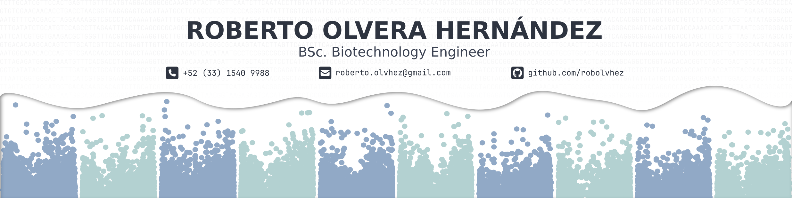

### Hey everybody! 👋 | It's me, Roberto Olvera-Hernández

---

# 👨‍🔬 About Me

**Doctoral Student in Biomedical Sciences (PDCB)** at the **Universidad Nacional Autónoma de México (UNAM)**.

My research focuses on **bias-free Genome-Wide Association Studies (GWAS)** for complex traits and diseases in the **Mexico City Prospective Study (MCPS)** cohort — one of the largest genotyped cohorts in Latin America with ~138,000 individuals. I use **family-based GWAS (FGWAS)** methods, including Mendelian Imputation of parental genotypes, to disentangle direct genetic effects from population stratification in recently admixed Mexican genomes.

# 🔬 Research & Tools

**Core methods:** `snipar` · Mendelian Imputation · FGWAS (Unified, Robust, NT estimators) · LD Score Regression · SuSiE fine-mapping · VEP annotation · Mendelian Randomization

**Daily toolkit:**

**Platforms & Infrastructure:**

**OS:**

**Editors & Design:**

# 💬 Rapid Fire

- 😄 Pronouns: he/him
- 💬 Ask me about: **Population genetics**, **family-based GWAS**, **Mexican biobanks**, or anything 🧬 biology!
- 🌱 Currently learning: **NextFlow** · **ShinyApps**
- 👯 Open to collaborate on: **omics projects**, **statistical genetics**, **biobank analyses**
- 📫 Reach me: **roberto.olvhez@gmail.com** | [LinkedIn](https://www.linkedin.com/in/rob-olvhez/)